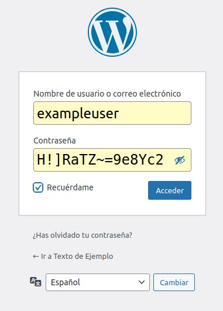
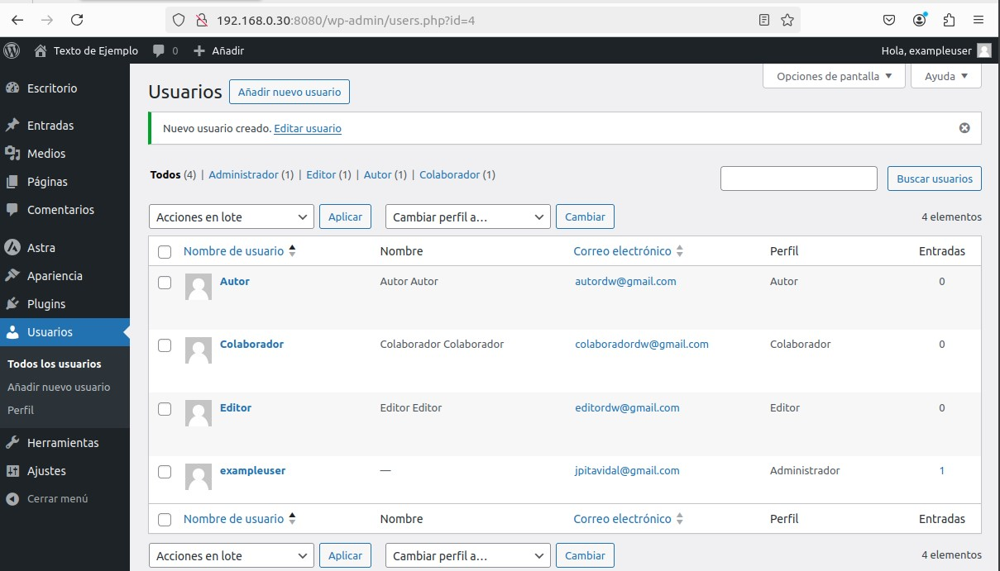
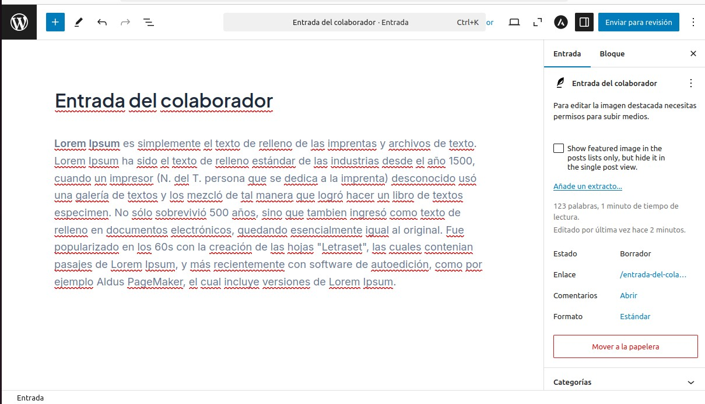
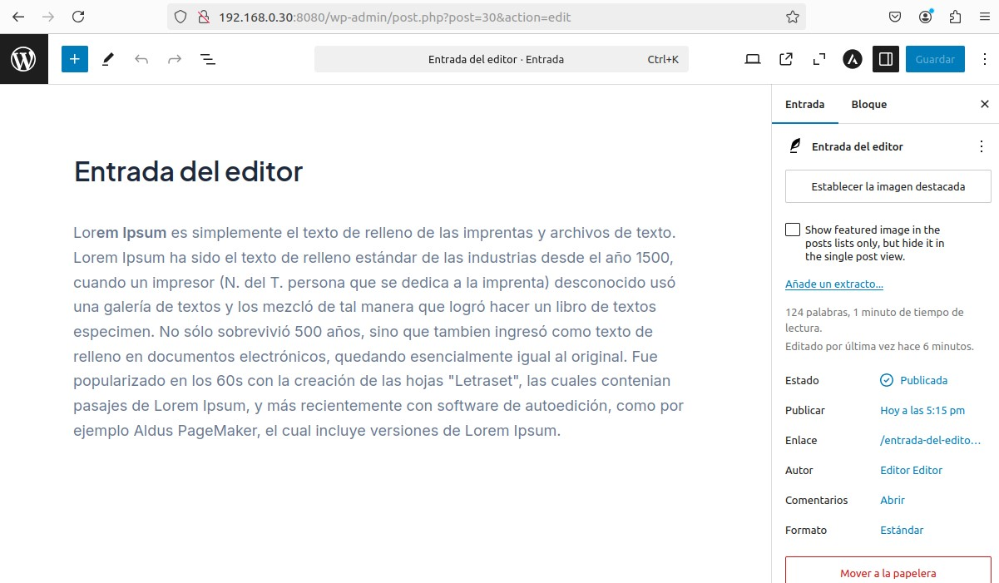
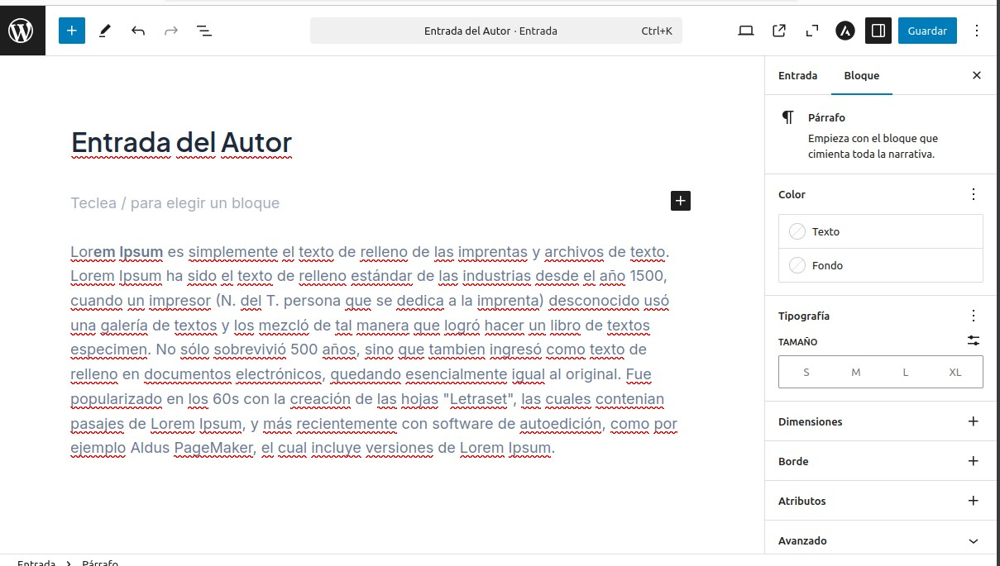

# Tarea8SXE

## Instalación:

Para este caso hemos utilizádo docker compose, la configuración utilizada es la siguiente
```
 wordpress: # Servicio para alojar la aplicación WordPress
    image: wordpress # Imagen oficial de WordPress desde Docker Hub
    restart: always # Reinicia automáticamente el contenedor si falla
    ports: 
      - 8080:80 # Mapea el puerto 8080 del host al puerto 80 del contenedor
    environment: # Variables de entorno necesarias para configurar WordPress
      WORDPRESS_DB_HOST: db # Dirección del servicio de base de datos (nombre del servicio 'db')
      WORDPRESS_DB_USER: exampleuser # Usuario de la base de datos
      WORDPRESS_DB_PASSWORD: examplepass # Contraseña de la base de datos
      WORDPRESS_DB_NAME: exampledb # Nombre de la base de datos que WordPress usará
    volumes: 
      - wordpress:/var/www/html # Persistencia para los archivos de WordPress

```
Se a utilizádo una base de datos mysql con la siguénte configuración:

```
db: # Servicio para la base de datos MySQL
    image: mysql:8.0 # Imagen oficial de MySQL versión 8.0
    restart: always # Reinicia automáticamente el contenedor si falla
    environment: # Variables de entorno necesarias para configurar MySQL
      MYSQL_DATABASE: exampledb # Nombre de la base de datos que se creará al inicio
      MYSQL_USER: exampleuser # Usuario que tendrá acceso a la base de datos
      MYSQL_PASSWORD: examplepass # Contraseña del usuario
      MYSQL_RANDOM_ROOT_PASSWORD: '1' # Genera automáticamente una contraseña para el usuario root
    volumes: 
      - db:/var/lib/mysql # Persistencia para los datos de MySQL
```
## Accéso y tema

Introduciéndo las credenciáles podremos acceder al servício


Y accederémos a la página de inicio, desde la cual en la pestaña 
de la izquierda en el icóno del pincel, seleccionámos la opción 
-`cambiar tema` para instalar el que más nos guste, en este caso se 
a elegido el tema -`Astra`

OJO: Cuidado al escoger tema, algúnos son de pago!!


## Usuários,entradas y permísos

Se han creado 3 usuarios:



Cada uno a echo una entrada diferente:







A la hóra de publicar

